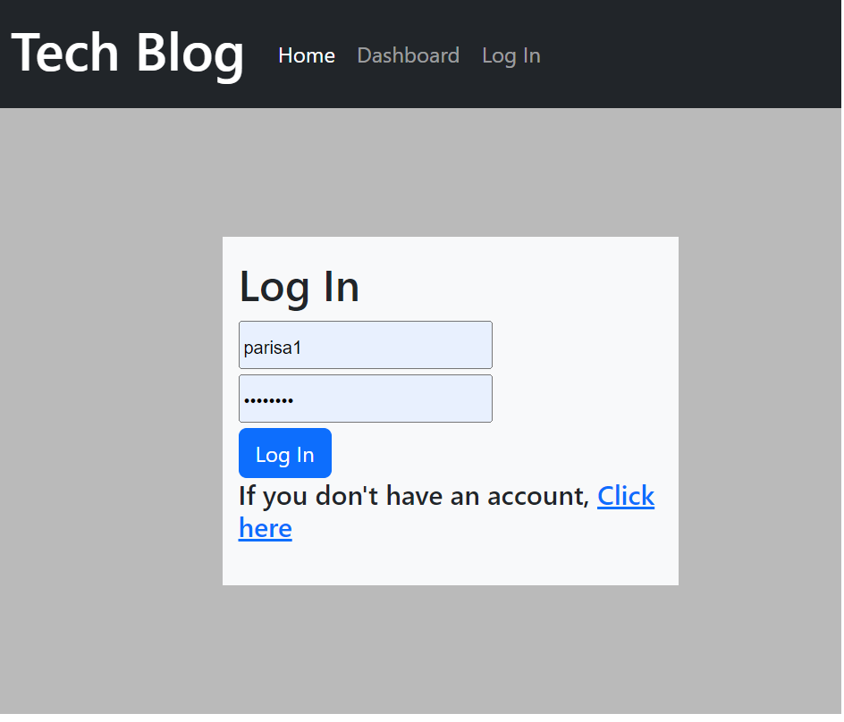
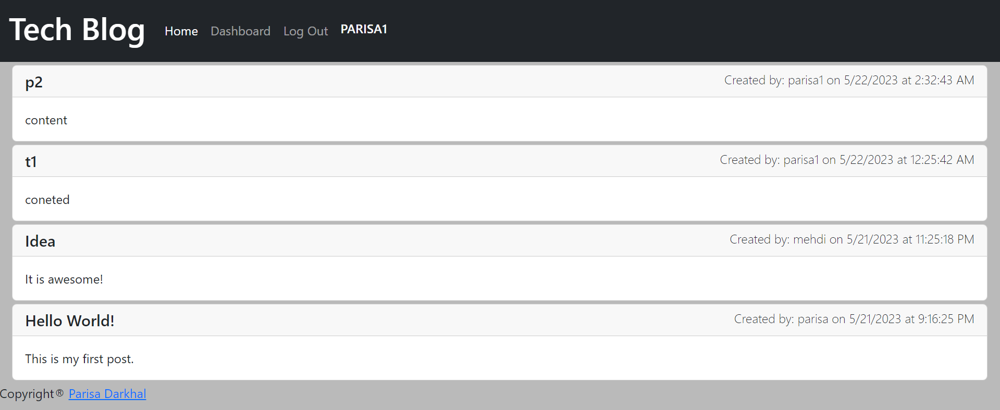

# Tech Blog

Tech Blog is a web application that allows users to post content and comment on other people's posts. Users are required to log in or sign up before they can make a post. Once logged in, the user's username is displayed along with a logout button. Users can view all the posts, with the newest posts displayed at the top, by clicking on the home button. They can also click on individual posts to leave comments.

## Features

- User authentication: Users can sign up or log in to access the features of the website.
- User profile: Once logged in, the user's username is displayed along with a logout button.
- Post viewing: Users can see all the posts, with the newest posts displayed first. The users can see their own posts on Dashboard.
- Commenting: Users can leave comments on individual posts.
- Display of post information: The user who posted a post and the time of posting are displayed.
- Display of comment information: The user who wrote a comment and the time of posting are displayed.
- Styling: The website is styled using the Bootstrap library.

## Technologies Used

- JavaScript
- MySQL
- Sequelize
- Handlebars
- Express
- Express Handlebars
- Path
- Express Session
- Connect Session Sequelize
- Bcrypt
- Dotenv

## Deployment

The website is deployed on Heroku.
[Visit Tech Blog on Heroku](https://tech-blog-pdg.herokuapp.com/)

## Installation

To run the Tech Blog project locally, follow these steps:

1. Clone the repository: `git clone https://github.com/ParisaDarkhal/Tech-Blog`
2. Navigate to the project directory: `cd tech-blog`
3. Install the dependencies: `npm install`
4. Create a `.env` file and add the necessary environment variables.
5. Set up the MySQL database.
6. Start the application: `npm start`

## Mockup

A mockup of the Tech Blog website is available

## License

This project is licensed under the MIT license. See the [LICENSE](LICENSE) file for more information.

## Contributing

Contributions to the Tech Blog project are welcome! If you find any issues or have suggestions for improvement, please open an issue or submit a pull request.

## Contact

If you have any questions or need assistance with the Tech Blog project, please contact us at [email protected]

Happy blogging!
